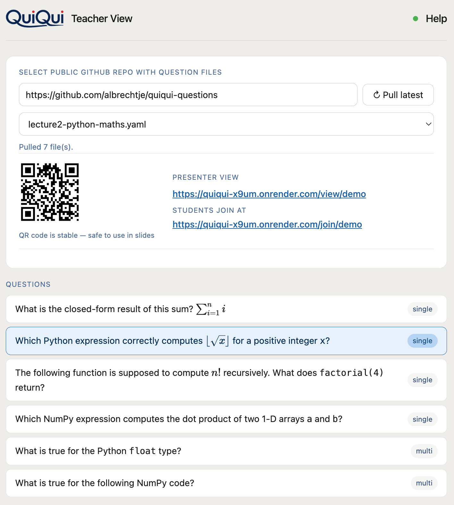
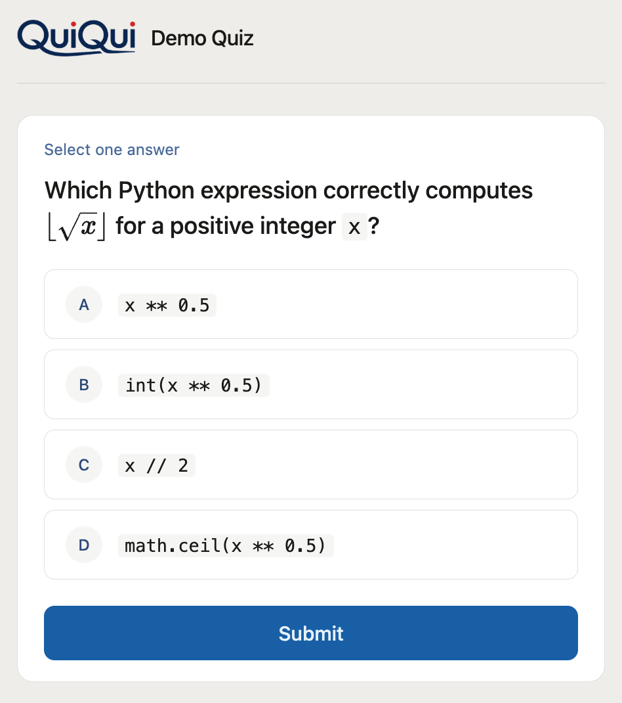

# Quickstart for Lecturers

> Part of the [QuiQui](https://github.com/albrechtje/quiqui) open source project. Hosted instance: [quiqui-x9um.onrender.com](https://quiqui-x9um.onrender.com) (may take ~30s to wake up on first visit).

QuiQui lets you pose a question to your class and see live answers on screen — no app, no login, no setup for students.

---

## What you need

- Your QuiQui teacher URL (bookmarked once, reused every lecture)
- A public GitHub repository with your question files — see [albrechtje/quiqui-questions](https://github.com/albrechtje/quiqui-questions) for the format

---

## Before the lecture (once)

1. **Set up your question repo** on GitHub with a [`config.yaml`](https://github.com/albrechtje/quiqui-questions/blob/main/config.yaml) and one `.yaml` file per lecture topic — see [Setting up `config.yaml`](#setting-up-configyaml) below
2. **Bookmark your teacher URL:**
   ```
   https://quiqui-x9um.onrender.com/<teacher-slug>?repo=https://github.com/you/quiqui-questions
   ```
   Contact the hosted service operator to receive your teacher slug.
3. **Put the student QR code or URL in your slides** — it never changes as long as `session_url` in `config.yaml` stays the same. The `session_url` must be **globally unique** on the server — see [Choosing a unique `session_url`](#choosing-a-unique-session_url) below
4. **Optionally bookmark the projector URL** (`/view/<session_url>`) to open in your browser during the lecture — it shows the live question and results on your beamer alongside the QR code

---

## Setting up `config.yaml`

Every question repo needs a `config.yaml` in its root. Start from the template: **[config.yaml in the question repo](https://github.com/albrechtje/quiqui-questions/blob/main/config.yaml)** — copy it into your own repo and edit the values.

```yaml
session_url: thn-db-alb      # unique student join URL segment — see below
title: Databases             # shown as "QuiQui: Databases" in header and tab
student_shortlink: https://t.ly/abc   # optional, a short link students can type
```

Step by step:

1. **Create your repo** — fork [albrechtje/quiqui-questions](https://github.com/albrechtje/quiqui-questions) or start a fresh public GitHub repo
2. **Add `config.yaml`** to the repo root, using the template above as a starting point
3. **Set `session_url`** to a unique value (see the next section — this is the important one)
4. **Set `title`** to your lecture name — it appears as `QuiQui: <title>` on the teacher and student pages
5. **Optionally set `student_shortlink`** if you have a short URL (e.g. from t.ly or your own redirect) that's easier for students to type than the full `/join/...` link
6. **Commit and push** — your repo is now ready to use

### Choosing a unique `session_url`

> ⚠️ **A session is identified by its `session_url`, not by you.** Everyone running with the same `session_url` on the same server shares **one** live session — the same active question, the same vote tally, the same results. Two lecturers who collide will silently overwrite each other's active question and mix their students' votes together.

This is easy to get wrong, because the natural choice is a generic abbreviation of the lecture — `databases`, `programming`, `nlp`. **These are exactly the names most likely to collide**, because another lecturer teaching the same subject will reach for the same word. The same trap applies if you and colleagues share one question repo: you all inherit its single `session_url`.

**Best practice — prefix with abbreviations that no one else would use.** Combine institution + course + lecturer (or any subset that makes it unmistakably yours):

| ❌ Too generic (will collide) | ✅ Unique |
|---|---|
| `databases` | `thn-db-alb` (TH Nürnberg · Databases · Albrecht) |
| `programming` | `tum-prog1-mueller` |
| `nlp` | `lmu-nlp-ws25` |
| `demo` | `ki-zentrum-demo` |

The `session_url` only needs to be unique among sessions running **at the same time** on the same server — but since you can't know what colleagues picked, a personal prefix is the safe default. Pick it once, put the QR code in your slides, and it stays stable for the whole semester.

> If you and colleagues want to run the **same demo** simultaneously, each of you must fork the questions repo and give your fork a unique `session_url`.

---

## Designing your questions

Question files (`.yaml`, one per lecture topic) live in the same repo. The **[question repo README](https://github.com/albrechtje/quiqui-questions)** has the full format reference, formatting instructions (Markdown + LaTeX math), and ready-made templates you can copy:

- **Per-lecture question files** — e.g. [`lecture1-python-basics.yaml`](https://github.com/albrechtje/quiqui-questions/blob/main/lecture1-python-basics.yaml) — single- and multiple-choice questions with optional `correct` answers and explanations
- **[`generic.yaml`](https://github.com/albrechtje/quiqui-questions/blob/main/generic.yaml)** — reusable A/B/C/D, Yes/No, True/False, and 5-point agreement-scale templates for slide-based questions where the text stays in your slides

Questions support plain text, **Markdown** (inline code, code blocks), and **LaTeX** math (`$...$` inline, `$$...$$` display).

### Two ways to use QuiQui

**With actual questions and correct answers in the YAML** — include a `correct` field. The **✓ Reveal** button highlights the right option(s) in green for everyone in the room.

**Generic / slide-based** — omit `correct` and keep your question text in your slides. QuiQui collects votes and shows the live bar chart; the Reveal button is hidden automatically. Each answer option is labelled with a letter badge (A, B, C, …), so students just call out or click the letter they see on the slide. The ready-made [`generic.yaml`](https://github.com/albrechtje/quiqui-questions/blob/main/generic.yaml) covers A/B/C/D, Yes/No, True/False, and a 5-point agreement scale — load it once and reuse it throughout your lecture.

### Editing later

Edit the `.yaml` files in your GitHub repo and click **Pull latest** in the teacher view to reload. No server restart needed.

---

## During the lecture



1. **Open your bookmarked teacher URL** — the repo is pulled automatically and the QR code appears
2. **Project the QR code** so students can join (or share the URL verbally)
3. **Select a lecture file** from the dropdown, then click a question to preview it
4. **Click ▶ Activate** — voting opens; badge shows **● Active**. Click again (**⏹ Deactivate**) to stop voting without revealing answers — students see the result bars but no highlights
5. **Click ✓ Reveal** to show the correct answers highlighted in green for everyone in the room
6. **Click ✕ Close** to send students back to the waiting screen without revealing answers
7. **Click Next question →** to move on — students return to the waiting screen automatically

> **Happy path:** Activate → (students vote) → Reveal → Close → Next question →

> **Tip:** Open the teacher page a minute before class — the app may take ~30 seconds to wake up on the free Render plan.

> **Session lifetime:** A session expires after **90 minutes of inactivity**. After expiry, click **Pull latest** to start a fresh session — the student URL stays the same.

---

## What students see



Students visit the join URL or scan the QR code — no login, no app install. They see "Waiting for the next question" until you activate a question. After submitting their answer (only once per question), the result bars appear live under each answer option.

- **Deactivate** — students see the bars without correct answer highlights
- **Reveal** — correct answers highlighted in green for everyone
- **Close** — students return to the waiting screen

If a student hasn't voted when you deactivate or reveal, they see "Voting has ended." and the bars — but cannot submit. If a student refreshes after submitting, they see the question with bars but cannot submit again.

---

## Projector view (beamer)


Open `/view/<session_url>` in your browser and project it on the beamer. It shows the same question and live result bars as the student view, plus the QR code and join URL — so students can scan at any time. No submit button, no interaction needed.

The projector URL is shown in the teacher view next to the student join URL as soon as a repo is pulled. If your organisation doesn't allow browser add-ins in PowerPoint, this is the recommended way to display live results during a presentation.
